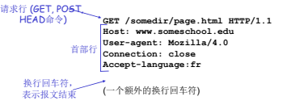
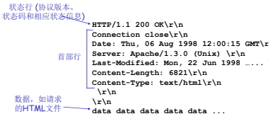

- 超文本传输协议，web的应用层协议。
- HTTP是一种无状态协议，每个HTTP请求都是独立的，服务器不会记录用户的信息或状态，这样可以更快的处理HTTP请求，并且没有状态维持，可以更快的建立缓存。但HTTP同样会需要状态维持服务，是通过cookie和会话状态管理来实现。
- ## 版本
	- ### HTTP1.0
		- http1.0是短连接，可能网络请求100张图，就需要Tcp握手挥手100次
	- ### HTTP1.1
		- http1.1是长连接，可创建长期的网络请求，可能连续网络请求100张照片，只进行一次握手挥手
		- http1.1相对于http1.0更新了缓存策略，并且一定程度上实现了宽带优化
		- http1.1相对于http1.0新增了 24 个错误状态响应码
	- ### HTTP2.0
		- http2.0相对于http1.1将头信息由ASCII编码转变为了二进制编码，二进制解析效率更高
		- http2.0 复用 TCP 连接，多个请求共用一个 TCP 连接，多个请求可以同时在这个 TCP 连接上并发
	- ### HTTPS
		- HTTPS 默认工作在 TCP 协议443端口，它的工作流程一般如以下方式：
		- 1、TCP 三次同步握手
		- 2、客户端验证服务器数字证书
		- 3、DH 算法协商对称加密算法的密钥、hash 算法的密钥
		- 4、SSL 安全加密隧道协商完成
		- 5、网页以加密的方式传输，用协商的对称加密算法和密钥加密，保证数据机密性；用协商的hash算法进行数据完整性保护，保证数据不被篡改。
- ## 报文格式
	- ### 请求报文
		- 
	- ### 响应报文
		- 
- ## 响应状态码
	- 100，请求继续
	- 200，请求成功
	- 301，请求的资源被永久转移到其他url
	- 302，url的临时移动
	- 400，请求语法错误
	- 404,请求的资源不存在
	- 500，服务器错误
- ## Cookies
	- 一种小型文本文件，是由网站服务器存储在用户端系统中。当用户访问网站时，网站对应的cookie也会被跟随发送。
	- 使网站能够追踪用户的信息，提供更好的服务。
	-
- ## Web缓存
	- 由浏览器存储在用户端系统的内容副本。
	- ### 浏览器本地缓存
		- 浏览器会将网站内容存储在本地，当用户再次访问相同网站时，可以从本地加载网站内容。
	- ### 代理服务器缓存
		- 相比于浏览器本地缓存，代理服务器同样会将网站内容存储在自己的本地，但是允许多个用户访问。
	- ### CDN缓存
		- 相当于是代理服务器集群，分布在全球各地，由CDN服务提供商提供。