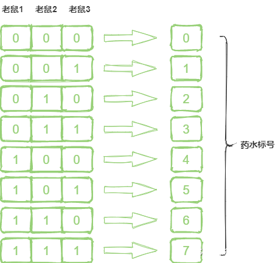

- #### 1.概率p输出1，概率1-p输出0，等概率输出0和1
- #### 2.一副牌除去大小王还有52张，其中10张牌是正面朝上的，要求一个盲人将牌分成两堆，并且每堆牌正面朝上的数量相同，可以任意翻动每张牌，应该怎么分
	- 分成10,42，将10翻转
- #### 3.两人玩游戏，在脑门上贴数字（正整数>=1），只看见对方的，看不见自己的，而且两人的数字相差1，以下是两人的对话：A：我不知道，B：我也不知道，A：我知道了，B：我也知道了，问A头上的字是多少，B头上的字是多少？
	- 2
- #### 4.在一个飞机场有N架飞机，每架飞机只有一个油箱，每箱油可以使飞机绕地球飞半圈。如果使一架飞机绕地球一圈，至少需要出动多少飞机？（要求所有飞机均能安全返回到机场，只能通过飞机给飞机这样加油方式，不能降落到机场加油）
	- 6架，前半段加油点1/8,2/8，后半段加油点7/8,6/8
- #### 5.一共有N颗石子，每次最多取M（M<N）颗最少取1颗，A，B轮流取（A先），谁最后拿完石子谁就获胜，请问最后谁会获胜？
	- 如果N可以被（M+1）整除时，无论A怎么拿，B都会保持拿完后石子的数量为（M+1）的倍数
- #### 6.高层扔鸡蛋问题：有一个100层的高楼，给你两个鸡蛋，需要测试出在哪层楼扔鸡蛋，鸡蛋不会碎。鸡蛋如果没有碎可以扔无数次。最少需要扔多少次？
	-
- #### 7.家里有两个孩子，一个是女孩，另一个也是女孩的概率是多少?
	- 因为两个孩子的性别只有男男、男女、女男、女女四种组合，男男被排除了，剩下三种组合均符合题意，所以是三分之一。
- #### 8.烧一根不均匀的绳，从头烧到尾总共需要1个小时。现在有若干条材质相同的绳子，问如何用烧绳的方法来计时一个小时十五分钟呢?
	- 将绳子１从一段开始烧，同时将绳子２从两端烧，绳子２在半小时后烧完。
	  这时开始计时，将绳子１的另一端点燃，从计时开始绳子１烧完后是15分钟
- #### 9.1000瓶药水里面只有1瓶是有毒的，毒发时间为24个小时，问需要多少只老鼠才能在24小时后试出那瓶有毒
	- log_2 1000向上取整
		- 以8瓶药水为例，二进制老鼠1位为1对应的药水，对老鼠1全部使用，老鼠2，老鼠3同理，最后以老鼠的中毒情况，组成二进制，在下图中查找结果
		- 
		-
- #### 10.一共12个一样的小球， 其中只有一个重量与其它不一样(未知轻重)，给你一个天平，找出那个不同重量的球？
	- 将12个小球分为三组（因为分成两组不能找到重量不一样的球在哪组），为A组、B组、C组
	  将三组球分别两两称重，找到重量和另外两组不同的那一组（只要有两组可以使天平平衡，重量不一致的球必然在第三组）。假设坏的球在C组
	  将C组的球分成两组C1和C2，每组两个球，这时从A组和B组里找到两个正常的球，分别和C1和C2去称，天平不能平衡说明重量不一致的球就在哪组。假设在C1
	  将C1组的球分别和正常的球去称，天平不平衡时就能找到重量与其他不一致的球
- #### 11.有10瓶药，每瓶有10粒药，其中有一瓶是变质的。好药每颗重1克，变质的药每颗比好药重0.1克。问怎样用天秤称一次找出变质的那瓶药？
	- 将这10瓶药标好号1-10。
	  然后按照瓶子的标号取药，1号药瓶取1粒药，2号药瓶取2粒药，3号药瓶取3例药，以此类推，取完10瓶药一起放到天平上去称。如果没有变质的药，重量应该是55克，这时多出几克，几号药瓶就是变质的。例如55.3克，那么变质的药就是3号药瓶的。
- #### 12.你有两个罐子，50个红色弹球，50个蓝色弹球，如何将这100个球放入到两个罐子，随机选出一个罐子取出的球为红球的概率最大？
	- 将一个红球放到一个罐子中，另一个罐子放49个红球和50个蓝球，这样随便选出一个罐子取出红球的概率是1/2 * 1 + 1/2 * 49 /（49+50），接近0.75。
- #### 13.你现在有一根金条，有一个工人为你工作了七天，他们的每天的工资是金条的七分之一，并且需要每天结清，你只能对金条切割两次，请问需要怎么做。
	- 这个问题和平时用的纸币金额是一个道理，将一根金条切割两次可以得到三根金条，这三根金条必须可以组合出1-7之间的任意金额。
	- 将金条分两次切成长度为1、2、4的金条即可。
- #### 14.有三个酒杯，其中两个大酒杯每个可以装8两酒，一个可以装3两酒。现在两个大酒杯都装满了酒，只用这三个杯子怎么把酒平均的分给4个人喝？
	- 可以允许边装边喝
- #### 15.50名运动员按顺序排成一排，教练下令：“单数运动员出列！”剩下的运动 员重新排列编号，教练又下令：“单数运动员出列！”如此下去，最后只剩下一个人，他是最开始的几号运动员？
	- 正向思维：
	- 运动员编号为1-50，单号出列后为2，4，6，…，50
	  运动员重新编号为1-25，单号出列后为2，4，6，…,24
	  运动员重新编号为1-12，单号出列后为2，4，6，…，12
	  运动员重新编号为1-6，单号出列后为2，4，6
	  运动员重新编号为1-3，单号出列后为2
	  反向思维：
	- 第五轮运动员的编号为2
	  第五轮编号为2的运动员在第四轮编号为4
	  第四轮编号为4的运动员在第三轮中编号为8
	  第三轮编号为8的运动员在第二轮中编号为16
	  第二轮编号为16的运动员在第一轮中编号为32
	  所以，剩下的最后一名运动员在开始的编号为32
- #### 16.一枚正反概率不一样的硬币，如何当一枚正常的硬币来用（正反概率相同）？
	- 答案是连续抛两次即可，第一次为正面、第二次为反面和第一次为反面、第二次为正面得概率相同。
- #### 17.
- #### 25匹马5条跑道找最快的3匹马，需要跑几次？
- #### 64匹马8条跑道找最快的4匹马，需要跑几次？
- #### 25匹马5条跑道找最快的5匹马，需要跑几次？
	- 思索nxn的表格，如果最快j匹马j小于跑道数量k，那么第一次比较分区第一名时就可以舍弃k-j的分区
	- 参考：(https://blog.csdn.net/qq_46588810/article/details/122088043)
	- 答案分别为7,11,10
- #### 18.彼此痛恨的甲、乙、丙三个枪手准备决斗。甲枪法最好，十发八中；乙枪法次之，十发六中；丙枪法最差，十发四中。如果三人同时开枪，并且每人每轮只发一枪；那么枪战后，谁活下来的机会大一些？
	- 如同田忌赛马一般，枪手甲一定要对枪手乙先开枪。因为乙对甲的威胁要比丙对甲的威胁更大，甲应该首先干掉乙，这是甲的最佳策略。
	- 同样的道理，枪手乙的最佳策略是第一枪瞄准甲。乙一旦将甲干掉，乙和丙进行对决，乙胜算的概率自然大很多。
	- 枪手丙的最佳策略也是先对甲开枪。乙的枪法毕竟比甲差一些，丙先把甲干掉再与乙进行对决，丙的存活概率还是要高一些。
- #### 19.A、B、C、D 四个人，要在夜里过一座桥。他们通过这座桥分别需要耗时 1、2、5、10 分钟，只有一支手电，并且同时最多只能两个人一起过桥。请问，如何安排，能够在17分钟内这四个人都过桥？
	- 因为有时间限制，所以我们得充分利用好速度快的人，尽量让快的人划船回来，因为过桥的时间是根据慢的一方决定的，所以还得让慢的人一起过桥，这样才能让总时间短。
	  方案：
	  第一趟：AB过桥，然后A回来，花费3分钟
	  第二趟：CD过桥，然后B回来，花费12分钟
	  第三趟：AB过桥，花费2分钟，总计17分钟。
- #### 20.有两位盲人，他们都各自买了两对黑袜和两对白袜，八对袜子的布质、大小完全相同，而每对袜子都有一张商标纸连着。两位盲人不小心将八对袜子混在一起。他们每人怎样才能取回黑袜和白袜各两对呢？
	- 每对袜子分的时候都将商标撕开然后一人一只，这样最后两个人刚好黑袜和白袜各两对。