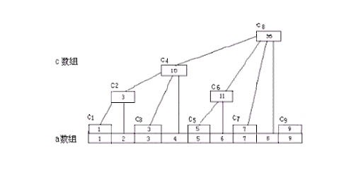

- ## 定义
- 1.将原数组转换成另一相同长度的数组，此数组存放的为原数组中某段的值之和。
- 2.数组的区间求和的复杂度是O(n)，树状数组可以将数组区间求和的复杂度降低到O(lg n)。
- {:height 220, :width 437}
  3.如图处理后的数组c,i位置的节点与其父节点之间的距离大小为lowBit(i)
  ```java
  private static int lowBit(int k){
          return k&-k;
      }
  ```
-
- ## 相关题目
  [[LCP 05. 发 LeetCoin]]
-