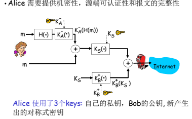
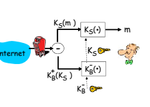

- ## 网络安全条件
	- 保证发送方式的鉴别，防止接受到虚假身份传来的信息
	- 保证报文的完整性，如果报文被第三方恶意修改可以及时察觉到
	- 保证数据的安全性，及时报文被截获到，也无法读取到信息
- ## 加密原理
	- ### 对称加密AES
		- 就是数据的发送方和接收方共享一个加密数据的密钥，这个密钥是隐私的，只有数据的发送方和接收方知，使用这个密钥进行加密，解密
		- #### 分享方式
			- KDC（密钥分发中心）
			- 非对称加密进行分享
	- ### 非对称加密RSA
		- 非对称加密系统中，参与加密解密的共有两个密钥，公钥和私钥，每一台主机都有自己的私钥和公钥，私钥只有自己知道，而公钥是公开的，可以让所有主机知道
		- 一般是送方在发送数据时，使用接收方的公钥进行加密，而接收方使用自己的私钥进行解密
		- #### 分享方式
			- CA（认证机构），认证机构会对数字证书（包含用户的公钥，身份信息）进行数字签名，想知道公钥的用户对其进行解密即可。
- ## 数字签名
	- 数字签名使用私钥对数据进行加密，生成签名，然后使用公钥来验证签名。这个过程与加密不同，因为数字签名并不是将数据加密，而是对数据的哈希值进行加密。哈希值是一个数据的固定长度的数字摘要，用于表示数据的完整性。
	- 数字签名的作用是验证数据的完整性。
- ## 安全电子邮件
	- 
		- {:height 165, :width 219}
		- Bob使用了Bob的私钥
		-
		- ### 发送方
			- 通过接收方的公钥对对称加密的私钥进行加密
			- 通过发送方自己的私钥进行数字签名
			- 用对称加密的私钥对数字签名和原始数据进行加密
		- ### 接收方
			- 通过接收方的私钥解析出对称加密的私钥
			- 利用对称加密的私钥解析出数字签名和原始数据
			- 用发送方的公钥解析出数字签名与原始数据的哈希进行比较看数据是否完整
- ## SSL
	- SSL使用对称加密和非对称加密技术，对数据进行加密传输。对称加密算法用于加密大量的数据，非对称加密算法则用于保护对称密钥的安全传输。这样，即使攻击者截获了传输的数据，也无法解密其中的内容。
	- 加密数据传输：SSL使用对称加密和非对称加密技术，对数据进行加密传输。对称加密算法用于加密大量的数据，非对称加密算法则用于保护对称密钥的安全传输。这样，即使攻击者截获了传输的数据，也无法解密其中的内容。
	- 验证身份：SSL使用数字证书来验证身份。数字证书由CA（Certificate Authority）机构颁发，包含了公钥、身份信息等内容。客户端和服务器在握手阶段交换数字证书，以互相验证对方的身份，确保通信的安全性。
	- 防止中间人攻击：SSL还使用数字签名和摘要算法来防止中间人攻击。数字签名和摘要算法可以检测和防止传输过程中数据的篡改和伪造，确保数据传输的完整性和真实性。
	- 防止重放攻击：SSL还使用时间戳、随机数等技术，防止攻击者通过重放攻击来窃取数据。这些技术可以确保每次通信的唯一性和安全性。