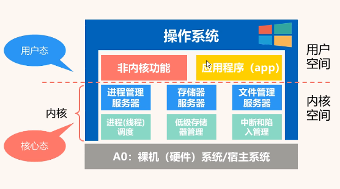

- 将具体的硬件资源抽象成软件资源
- 开放了简单的访问方式，隐藏了具体细节
- ## 类型
	- ### 分时操作系统
		- 实现多用户多任务并发执行，关注用户体验
		- 依据轮询调度算法来给各个任务分配固定大小时间片来完成任务
		- #### 目的：
			- 分时操作系统旨在最大化计算机资源利用率，如常见的 Windows、macOS 和 Linux。
	- ### 实时操作系统
		- 保证任务实时响应，关注任务时效
		- 用优先级调度算法来完成各个任务
		- #### 目的：
			- 实时操作系统则旨在保证快速响应和精确控制时间。[它们通常用于工业（武器）控制系统、信息查询系统、多媒体系统和嵌入式系统等领域。
- ## 操作系统运行环境
- 
	- 用户态：进程所能访问的内存空间和对象受到限制，其所处于占有的处理器是可被抢占的。
	- 内核态：则能访问所有的内存空间和对象，且所占有的处理器是不允许被抢占的。
	- 用户态切换到内核态主要是通过中断、异常、陷入机制(访管指令)
	- ### 内核支撑功能
		- #### 时钟管理
		- #### [[原语]]
		- #### 中断
			- 内中断
			- 外中断
			- 过程：关中断-保存上下文-开中断-运行中断程序-关中断-恢复上下文-开中断-继续执行
	- ### 系统调用
		- 应用程序访问内核态服务的方式
- ## 基本特征
	- ### 并发
	  同一时间间隔内执行，调度多个程序
	- ### 共享
	  系统资源供多个并发程序共同使用
	- ### 异步
	  多个程序分序交替进行
	- ### 虚拟
	  把物理实体变成多个逻辑上的对应物
- ## [[进程管理]]
	- 进程控制，进程同步，进程优先级
- ## [[内存管理]]
	- 内存分配，内存保护，内存扩展
- ## [[文件管理]]
	- 文件存储管理，文件目录管理，文件读写权限管理
- ## [[输入输出(I/O)管理]]
	- 提供一个让用户交互的造作系统
- ## 面试
	- ### 64位操作系统和32位操作系统的区别？
		- 64位操作系统只能安装到64位电脑上，32位操作系统可以安装到32位计算机和64位计算机上
		- 64位CPU的数据宽度为64位比32位长，运算能力更强