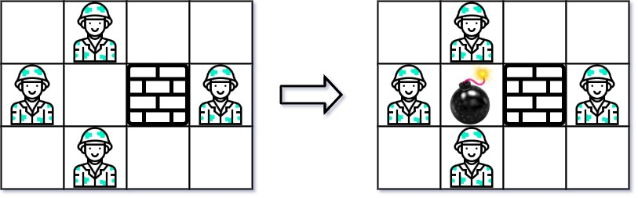

- ## 题目
	- 给你一个大小为 m x n 的矩阵 grid ，其中每个单元格都放置有一个字符：
	- 'W' 表示一堵墙
	  'E' 表示一个敌人
	  '0'（数字 0）表示一个空位
	  返回你使用 一颗炸弹 可以击杀的最大敌人数目。你只能把炸弹放在一个空位里。
	- 由于炸弹的威力不足以穿透墙体，炸弹只能击杀同一行和同一列没被墙体挡住的敌人。
	- 
- ## Code
	- 方法一：动态规划
	- 对网格每个点进行横竖动态规划统计能击杀的最大人数
	- 最后遍历每个点求横竖之和最大值
	- ```java
	  class Solution {
	      public int maxKilledEnemies(char[][] grid) {
	          int row = grid.length;
	          int col = grid[0].length;
	          // 记录炸弹可以炸死的敌人最多个数
	          int max = 0;
	          // 记录可以被炸死的敌人个数(躲在墙后面的敌人不可以被炸死)
	          int pre;
	          // dp[i][j]表示i，j处的炸弹可以炸死的敌人个数
	          int[][] dp = new int[row][col];
	          // 计算出炸弹所在行可以炸死的敌人个数
	          for (int i = 0; i < row; i++) {
	              // 初始化炸弹所在行可以炸死的敌人个数为0;
	              pre = 0;
	              // 从左向右来遍历（炸弹右边的敌人炸不死)
	              for (int j = 0; j < col; j++) {
	                  if (grid[i][j] == 'E') {
	                      pre++;
	                  } else if (grid[i][j] == 'W') {
	                      // 墙体左边的敌人不应该被炸死
	                      pre = 0;
	                  } else {
	                      dp[i][j] += pre;
	                  }
	              }
	              pre = 0;
	              // 从右向左来遍历（炸弹左边的敌人炸不死)
	              for (int j = col - 1; j >= 0; j--) {
	                  if (grid[i][j] == 'E') {
	                      pre++;
	                  } else if (grid[i][j] == 'W') {
	                      // 墙体右边的敌人不应该被炸死
	                      pre = 0;
	                  } else {
	                      dp[i][j] += pre;
	                  }
	              }
	          }
	          // 计算出炸弹所在列可以炸死的敌人个数
	          for (int j = 0; j < col; j++) {
	              // 初始化炸弹所在列可以炸死的敌人个数为0;
	              pre = 0;
	              // 从上向下来遍历（炸弹下边的敌人炸不死)
	              for (int i = 0; i < row; i++) {
	                  if (grid[i][j] == 'E') {
	                      pre++;
	                  } else if (grid[i][j] == 'W') {
	                      // 墙体上边的敌人不应该被炸死
	                      pre = 0;
	                  } else {
	                      dp[i][j] += pre;
	                  }
	              }
	              pre = 0;
	              // 从下向上来遍历（炸弹上边的敌人炸不死)
	              for (int i = row - 1; i >= 0; i--) {
	                  if (grid[i][j] == 'E') {
	                      pre++;
	                  } else if (grid[i][j] == 'W') {
	                      // 墙体下边的敌人不应该被炸死
	                      pre = 0;
	                  } else {
	                      dp[i][j] += pre;
	                  }
	              }
	          }
	          for (int i = 0; i < row; i++) {
	              for (int j = 0; j < col; j++) {
	                  if (grid[i][j] == '0') {
	                      max = Math.max(max, dp[i][j]);
	                  }
	              }
	          }
	          return max;
	      }
	  }
	  ```