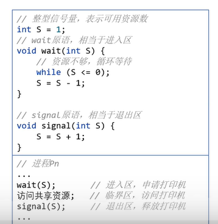

- 同步：进程间协调的可靠性
- 互斥：访问一个共同资源，需要保持他们的次序性
- ## 实现
	- ### 信号量机制
		- 进程进行某项同步操作必须按照，P操作，访问，V操作的流程来进行
		- 整性信号量样例：
		- 信号量初始值为1，进程1进入后，如果信号量为0就进入循环等待，不为0就将信号量减1
		- 这时候进程1进行资源访问，进程2想要访问就会由于信号量为0,陷入等待，直到进程1使用完资源进行V操作将信号量加1。
		- 
		- 可以通过设置信号量最大值来限制能够访问资源的最大进程数目，这是互斥锁无法实现的。
	- ### 互斥锁机制
		- 保证同一时刻只有一个进程可以访问共享资源，其他进程需要等待当前进程释放互斥锁后才能访问共享资源，不能保证顺序。
	- ### 读写锁机制
		- 互斥锁的优化，它允许多个进程同时读共享资源，但只允许一个进程写共享资源。
- 底层实现均需要用到底层的原子性操作
  background-color:: red